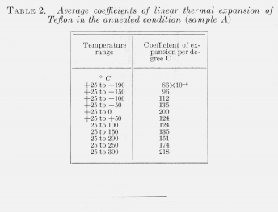
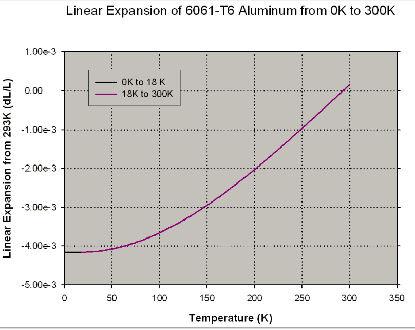

*\# Ideas surrounding a shrink-fit endcap design:*

\#\# Main arguments for:

PTFE has a larger coefficient of thermal expansion than aluminum at all temperatures. By adding an extended lip to the endcap that the PTFE can clamp down on during the cryo-fill process, a mechanical seal can be formed, isolating the LOX from the CF and adhesive. The End-cap can be shrunk with LN2 prior to insertion, allowing for a compression of the PFTE prior to fill, so a seal can be established at room temp. This solution also reduces complications related to layer separation and simplifies the layup procedure by eliminating the need to etch and adhere the PFTE to the CF structural layers (LOX sealant can be put in at this interface).

\#\#\# Potential concerns:

-Excessive PTFE contraction leading to cracking of PTFE or permanent deformation of PTFE that prevents reuse of the tank.

\#\# Analysis to do:

Q: How to compress the PTFE and properly retain the lox seal during the chill process?

\*\*Calculate the unrestricted expansion expected in the radial direction of the inset endcaps when

subjected to shrink fit - expansion.

\*\*Calculate final diameters of PTFE and AL when both subjected to cryo-temps

\#\# build to do:

-simplified ring and endcap designs without complex geometry and screw holes.

-shorter virgin PTFE tubing for testing.

\#\# PTFE Properties: 

-Fairly uniform compressive strength across PTFE grades

-Inert when exposed to LOX (unless there is contamination, pigmentaiton, or filler present)

-Deformation under load: max 50% (at 1000 psi over 24 hrs)

-Thermal conductivity: 0.2+/- 0.04 W/m\*K

-Yield strength of teflon at -196C = 131 MPA, 19,000 PSI

-Meaning the PTFE should bounce back to its original dimensions when cooled, assuming

-it is only elastically compressed.

-Mod E of Teflon PTFE = 56.9-326 ksi (Quite a range)

-CTE of Teflon PTFE (+25 to -190C) = 86e-6 +/- 3e-6 (1956 Kirby text)

\#\# Aluminum Properties

Mod E of AL6061 = 10000 ksi

CTE of AL6061 = starting at 23e6 and decreasing with temperature

Yield Strength of AL6061 at -190C: 47, 000Psi

