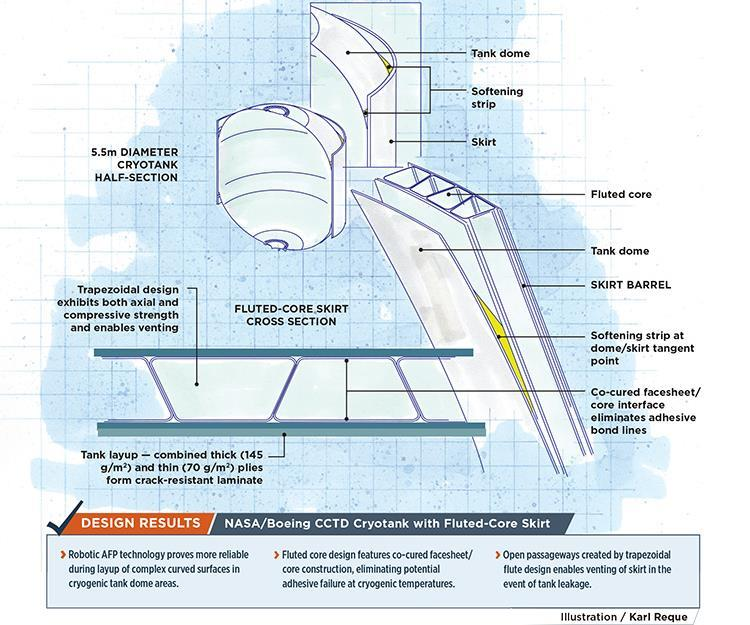
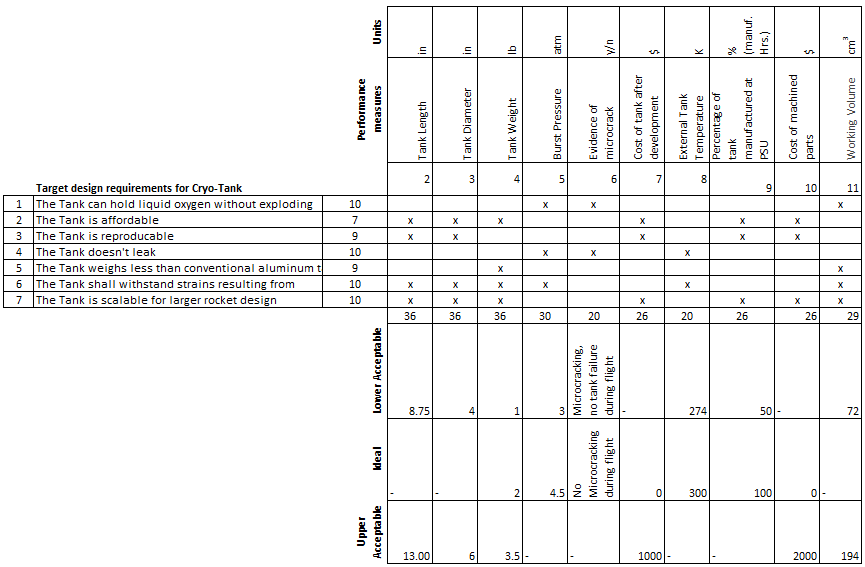

*Submission Requirements:*

**Abstract Title (Title Case):** Design and Manufacture of Composite
Liquid Oxygen Propellent Tank for University Rocket

**Presenter Biography (200 Words Max):** Chris Wilson is a Mechanical
Engineering student at Portland State University. He is active with the
Portland State Aerospace Society (PSAS) and involved in their CubeSat
project.

Wilson has managed to maintain a strong GPA, full time status, a job and
a family. Growing up, Wilson watched his father work and maintain
sailboat engines while traveling from one country to another. Observing
his father operate marine diesel engines created a strong understanding
and love of mechanics. He has worked as an emergency medical technician,
volcano tour guide and volunteer firefighter. When he graduates he
aspires to enter the aerospace field and make meaningful contributions
to space travel.

**Presentation Type:** Technical Paper

**3 keywords (min) (Dropdown list):** Aerospace Design and Aerospace
Structures

**Authors:** Neil Benkelman, Russell Berger, Weldon Peterson, Alex
Farias, Francesca Frattaroli, Christopher Wilson

**Topic:** Space Transportation and Launch Systems

> *Supported by the AIAA Space Transportation Technical Committee and
> the AIAA Reusable Launch Vehicle Program Committee*
>
> The commercial, military, scientific, and human exploration of space
> depends upon highly reliable access at reasonable costs. Commercial
> companies have offered the promise of low-cost space access, and some
> are currently developing, testing, and operating their systems. NASA
> has begun operation of low-cost, reliable commercial cargo delivery,
> and is developing crew delivery, to the International Space Station
> (ISS). The NASA Space Launch System (SLS) will provide the Orion
> crewed spacecraft a capability to reach deep space destinations.
> Launch capabilities are also emerging on several fronts to transport
> the increasing number of small satellite payloads to orbit.

-   Emerging launch system designs, concepts, and developments

-   Space transportation technology design, and integration challenges

-   In-space transportation systems and architectures, including
    > propellant depots

-   Launch vehicles and systems (including suborbital)

-   RLV development, programmatic (including economics), and
    > industry-related strategies

-   Lessons learned from previous programs and design studies

-   Space transportation for space tourism

-   Space transportation analytical tools, materials, and technologies

-   Operations of spaceports and ranges

**Please direct questions to: (Space Transportation and Launch Systems
contacts)\
***[Brian Pomeroy\
](mailto:brpomeroy@gmail.com)[Steve Bauer\
](mailto:steven.x.bauer@nasa.gov)[Dave
Masten](mailto:dmasten@masten.aero)*

**Abstract:**

“Each submission must be formatted as an extended abstract with a
minimum of 1000 words, or as a draft manuscript. The submission must
include sufficient detail to demonstrate the purpose of the paper, the
technical foundation for the topics to be discussed, any preliminary
results to date, and the expected results of the final paper, including
key figures, equations, tables, and references, as appropriate.
Sufficient information must be included in the submission to convince
the Forum organizers and reviewers that the author(s) will have a strong
likelihood of completing the final paper by the final manuscript
submission deadline.”

**Design and Manufacture of Liquid Oxygen Propellent Tank for University
Rocket**

1.  **Abstract (of the Abstract):**

    a.  **Goal: Design and documentation of composite LOX rocket tank **

    b.  **Contribution to PSAS mission**

    c.  **Anticipated results**

2.  **Introduction:**

    a.  **objective: replace Al, reduce dry weight, retain necessary
        > strength and chemical non-reactivity**

    b.  **past work/results - airframe, composite tank literature**

    c.  **theoretical background/basis**

    d.  **expected finished product**

3.  **Significance:**

    a.  **reach von karman line**

    b.  **dependent PSAS projects - EFS**

    c.  **advancement of university rocketry**

4.  **Plan of Work:**

    a.  **pre-existing resources/techniques**

    b.  **design methods**

    c.  **test methods**

    d.  **timeline**

    e.  **final product and testing**

Design and Manufacture of Composite Liquid Oxygen Propellent Tank for
University Rocket

**1-Abstract**

When designing a rocket to overcome Earth’s gravitational force, the dry
mass of the propellent tank is the most limiting factor for amateur and
university-level rocket teams. Most rocket groups are dependent upon
heavy aluminum tanks to hold their liquid propellant. Single-piece,
carbon-fiber composite tanks are strong and light, but require expensive
automated fiber placement techniques that are not a viable option for
amateur teams, who operate with a tight budget and limited resources in
comparison to their corporate or government counterparts. Portland State
University’s composite-tank capstone and research project is an attempt
by senior undergraduate engineering students to design, build, and test
an affordable, lightweight, composite liquid oxygen (LOX) propellant
tank for eventual integration into Portland State Aerospace Society’s
100 kilometer rocket.

**2-Introduction**

For the past decade, amateur and university rocketry groups have been
undertaking an impromptu space race to breach the Von Karman Line (100
km above earth’s surface). The greatest barrier to success is the ratio
of the mass of the fueled rocket to its dry mass. This is commonly
referred to as the mass ratio. Tsiolkovsky’s rocket equation shows that
the mass ratio must increase exponentially with the rocket’s change in
velocity. In simpler terms, if you want to go faster and higher you must
decrease your dry weight, and small weight savings make a large
difference. Conventional amateur and university rockets are constrained
to lower altitudes by the use of either solid propellant or liquid
propellant housed in aluminum fuel tanks with relatively low mass
ratios. A mechanical engineering senior capstone group at Portland State
University is working to mitigate this dry mass limitation by designing
a liquid oxygen propellant tank out of primarily composite materials
which will be much lighter than all-aluminum equivalents. This design
requires the development of corresponding manufacturing techniques that
take into account the differing thermal, chemical, adhesive and
structural properties of the composite materials, and their need to
interface with each other, and with aluminum components.

Two previous PSAS capstone groups have focused on improving the overall
dry-weight of the PSAS LV3 rocket, a third generation solid-propellant
rocket. The 2014 and 2016 Airframe capstone teams developed a unique
carbon-fiber composite layup technique[^1], in which layers of carbon
fiber, adhesive, and nomex honeycomb were laid up onto 6-inch aluminum
mating rings, producing 18-inch airframe modules that were then mated
together to form the body of the LV3 rocket. Having significantly
reduced the mass of the rocket in this way, PSAS is seeking to reduce
the mass of the internal components, starting with the propellant tank
module.

**3. Significance:**

Being able to design a working, lightweight, liquid-propellant tank
using resources accessible to a university student organization, will
not only assist the PSAS community in achieving its goal of breaching
100km and exploring high altitude science by putting a cubesat into
orbit, but provide the greater rocket community with a more affordable
and accessible tank design. Due to its nature as an open source project,
all results will be posted publicly, allowing any future university or
amateur team to benefit. Additionally, the financial and technical
constraints of this project also pose an opportunity to develop unique
solutions to the problem of cryotank design that could benefit industry
and science as a whole.

**4-Plan of Work**

The scope of this project builds on the previous work of other student
groups. As previously noted, a 2016 capstone group developed a layup
process and design of a lightweight composite airframe. Investigation
into what techniques, procedures, and materials that can be adapted from
this project are already underway. Additionally, research into composite
cryotank technology,[^2] and associated methods and safety protocols has
already been done before; PSAS has aggregated hundreds of relevant
technical papers and NASA procedural documents which are currently being
evaluated by the design team and are expected to inform initial designs,
material selection, and testing methods.

{width="4.296875546806649in"
height="3.5677088801399823in"}{width="3.682292213473316in"
height="2.0494706911636045in"}

  *Figure 1: NASA/Boeing CCTD Cryotank with Fluted-Core Skirt. Illustration: Karl Reque*   *Figure 2: 2015-2016 Composite PSAS airframe layer configuration*
  ---------------------------------------------------------------------------------------- -------------------------------------------------------------------

Substantial material resources were donated by Boeing and other industry
sponsors (8-139 prepreg, 8-222 Cycom 6070/7781, BMS 8-308C 60001, etc.)
to PSAS for use with the 2016 capstone and have since been acquired to
be used with this Composite Tank design. Existing material resources and
composite layering techniques will be tested first, for structural
integrity at cryogenic temperatures, before other materials are
considered for testing. At the initial design stages, there are many
options under consideration: composite types, layering methods, tank
geometries, assemblies, and manufacturing procedures will all be
researched, developed, and tested for viability at cryogenic
temperatures and launch loading conditions.

The project is currently in a research and project design phase, along
with preliminary material testing and assembly design. During this
phase, major design constraints, challenges, and corresponding testing
methods are being identified, along with best practices of
documentation, analysis, and evaluation. Major challenges already
identified include-- designing tank mating rings to interface with air
frame, matching the form factor of an airframe module, developing
aluminum tank endcaps to interface and seal with composite body,
providing adequate chemical and thermal insulation, and developing a
layup of selected materials to fit onto final geometry.

In identifying viable designs, an iterative design process, coupled with
material testing (thermal, tensile, and impact) and finite element
analysis (body force and thermal stress analysis) will first be
conducted. This will be followed by the fabrication of multiple scale
prototypes of designs or design combinations that proved successful.
Prototypes will then be subjected to both hydro and cryo testing
procedures to identify leaks, rates of thermal conduction, oxygen
diffusion, and microcracking and points of structural failure. Given
time, there is potential for a full-scale (LV3-size) prototype tank,
subject to the same testing methods and analysis. Capstone requirements
dictate that this research project and associated documentation be
completed by mid-June 2017.

The ultimate goal is to produce a subscale cryogenic fuel tank that can
safely contain liquid oxygen at operational pressures (3 ATM[^3]) and
temperatures (-183 ℃) for the duration of the rocket pre-launch
procedure (approx. 1 hour, depending on tank scale). Documentation of
measurements, test methods, and development procedures are of equal
importance to successful project completion. This emphasis on
documentation is in line with PSAS’ educational mission to advance
amature and university-level rocketry by making all of its research and
discoveries available to the public.

**Appendix**

i\. System requirements-measurements matrix.

{width="8.401042213473316in"
height="5.468009623797025in"}

[^1]: Shields, J. P., and Elwood, L., “Design and Manufacture of an
    Open-Hardware University Rocket Airframe using Carbon Fiber,” *AIAA
    SPACE 2016*, American Institute of Aeronautics and Astronautics,
    2016.

[^2]: Johnson, T. F., Sleight, D. W., and Martin, R. A., “Structures and
    Design Phase I Summary for the NASA Composite Cryotank Technology
    Demonstration Project,” 2013, pp. 1–11.

[^3]: Three ATM is a relatively low pressure for a propellant tank of
    any size. This low pressure is made possible by the parallel PSAS
    development of an electric feed system that will replace the current
    blowback system for the LV4 rocket.
