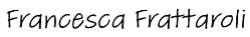
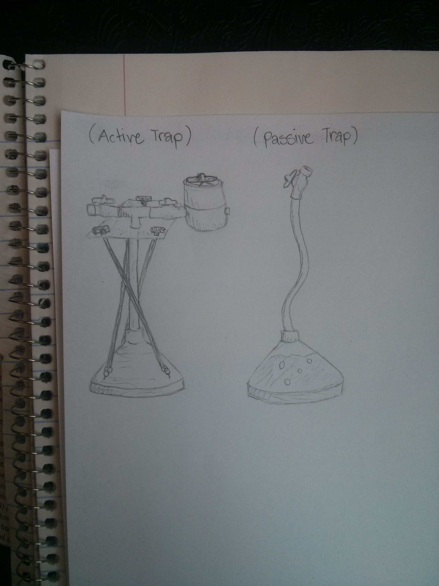
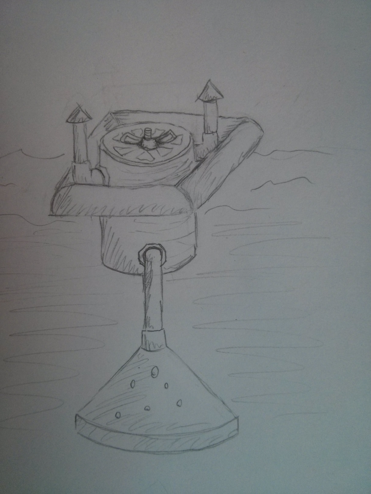
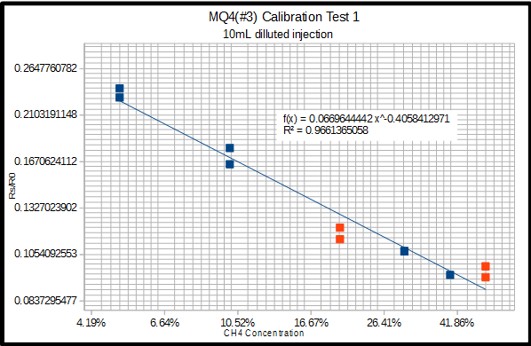
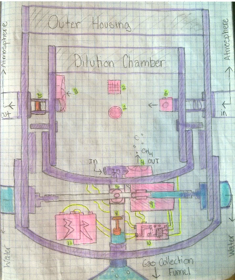
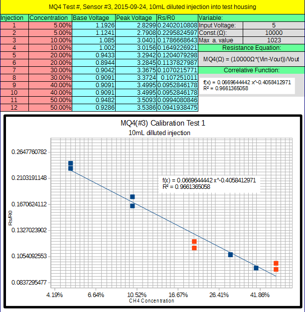
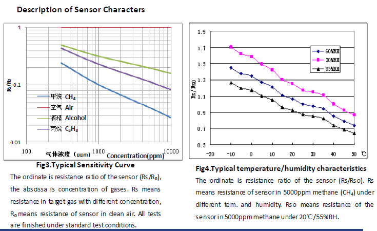
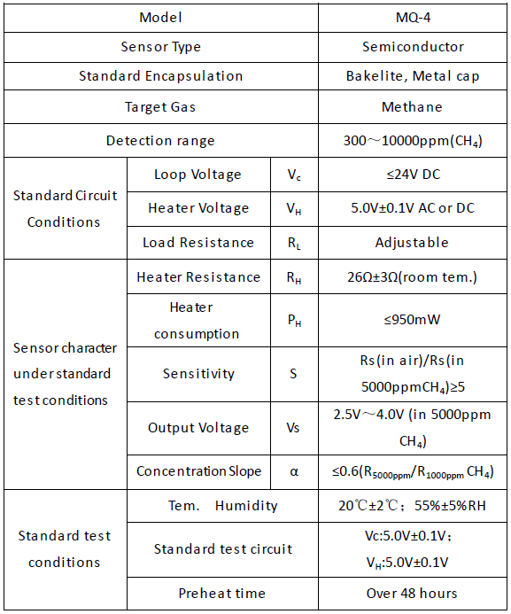
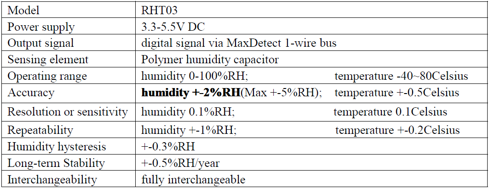
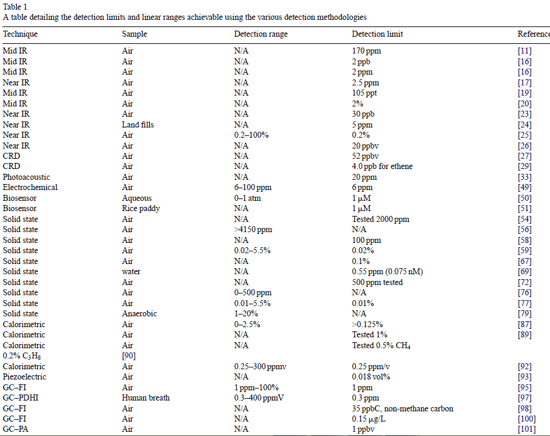

**TO:** Dr. Harrison

**FROM: **Francesca Frattaroli

**DATE: **2015-11-28

**SUBJECT: **General Proposal for the development of a low-cost, methane sensor for in-situ ebullition measurement.

Dear Dr. Harrison,

I submit the report, “The Design and Production of a Low-Cost, Methane Sensor for In-Situ Ebullition Measurement”

This report outlines the weaknesses of WSU Biogeochemistry Lab's current means of methane ebullition data collection and proposes the in-house development and production of a new methane sensor.

It is shown in this report how an in-situ methane sensing device could be built for around $500 dollars a unit.

This report recommends allocating money and staff time to the development of this sensor which, once operational, would save time and money ($25,000/year) as well as provide more temporally precise data for analysis.

Sincerely,

Francesca Frattaroli

The Design and Production of a Low-Cost, Methane Sensor for In-Situ Ebullition Measurement

Prepared for Dr. John Harrison

Washington State University Global Change and Watershed Biogeochemistry Lab

By Francesca Frattaroli

**Table of Contents**

List of illustrations/graphics0

Executive Summary1

Report Introduction2

Analysis of Data3

Conclusion from Data8

Recommendations 9

Concluding Remarks10

Bibliography11

Appendices12

**List of Figures/Tables/Illustrations**Page

1.  

2Proposed Methane Trap Design4

3Preliminary Methane Sensitivity Test Results 5

for MQ-4 sensor on log-log scale graph.

4Detailed Draft Design of Proposed Methane 6

sensor

**

**Executive Summary**

****

This report outlines the weaknesses of WSU Biogeochemistry Lab's current means of methane ebullition data collection and proposes the in-house development and production of a new methane sensor.

The current methane traps are limited in how much gas they can collect and need to be frequently sampled in the field, with those samples being brought back to the lab for additional processing. This costs money and man-hours that could be saved by the development of a new, automated, in-situ methane gas sensor.

It is shown in this report how commercially available sensors are too expensive to be worthwhile, but an equivalent sensor could be built for around $500 dollars a unit, which is affordable.

This report recommends allocating money and staff time to the development of this sensor which, once operational, would save time and money ($25,000/year) as well as provide more temporally precise data for analysis.

****

****

****

****

**

**Report Introduction**

Washington State University Biogeochemistry Lab's Methane Ebullition Study is an attempt to characterize methane gas emissions from the Lacamas Reservoir by identifying spatial and temporal trends in methane ebullition and associated environmental and reservoir-management factors.

 In addition to analyzing data provided by external sources, such as weather stations and Lacamas Dam management, primary data on the location and rate of methane ebullition is also collected and analyzed. **The current tools used for collecting this data have limitations and drawbacks that could be eliminated by the adoption of a new tool: *****an in-situ methane ebullition sensor.***

This report outlines the relative advantages of this new tool, how it might work, and how it could be successfully designed and produced within the financial constraints of the lab budget.

**Analysis of Data**

The ***current method of methane ebullition data collection*** on lake Lacamas includes an array of approximately 15 methane traps distributed throughout the lake (a mix of active and passive) which collect bubbling gas for later manual extraction and in-lab processing. The current capabilities and limitations are as follows:

*Capabilities*:

-   Active traps possess real-time, gas volume measurements (with 30 second resolution).

-   Both active and passive traps provide average methane concentration (1-day to 2-week resolution) of collected gas after manual sample extraction and high-resolution (+/- 2% error) in-lab analysis.

-   Passive traps do not require a power source.

 *Limitations*:

-   No real-time concentration values (extracted samples require in-lab processing and represent average concentration over collection period only).

-   Finite gas capacity (&lt;1000ml), requires frequent extraction (every couple days/weeks depending on ebullition rates).

-   Extracted samples require additional in-lab

 processing (time and money).

The active trap is the most complex of the two, has the most capabilities, and is modeled after the design set forth by Varadharajan in her 2010 paper, *A low-cost automated trap to measure bubbling gas fluxes. *It includes a budget for material costs, which places electronic component costs at around 85 dollars per unit and mechanical costs at approximately 100 dollars per unit, bringing the total cost of production, excluding labor, in at just under $200.

The ***proposed, in-situ methane sensor*** would have the following capabilities and limitations:

*Desired Capabilities*:

-   Real-time, gas volume and methane concentration measurements (resulting in more time-correlated data).

-   Gas would be released after measurement (no capacity limitation, requiring less frequent in-person maintenance/data collection).

-   No in-lab chemical analysis necessary (saves time and money).

-   Affordable to replicate (maintain spatial resolution provided by number current traps).

*Anticipated Limitations:*

-   More electronically/mechanically complex than current traps (more points of failure and higher per-unit cost).

-   Less precise concentration measurements than samples processed in-lab (Field equipment precision can't compete with in-lab equipment).

There are on-the-market methane traps that have some of the desired capabilities, such as an ebullition trap that releases gas automatically[1], but they cost around 10,000 dollars per unit and would still have to be modified with a concentration sensor. Therefore, this report proposes the development of a sensor mechanism in-house.

After direct consultation with the budget director, Dr. Harrison, **a target production cost of $500 dollars per unit**, excluding labor and design costs, was arrived at. This is the definition of 'low-cost' used in this report.

The basic structure of the active trap can form the basis of the in-situ methane sensor, with two added components: a gas release mechanism and a methane concentration sensor. Assuming that the base cost of the in-situ sensor trap is equal to that of the active trap, there are $300 dollars allotted for the materials of these new components (and their control systems) to keep the project on budget.

*Methane Concentration Sensor Requirements*:

 According to Dr. Harrison, an accuracy of +/-5% (+/- 50000ppm) is sufficient to yield analyzable concentration data. In the gas samples currently being collected from the lake, methane is regularly recorded in concentrations in excess of 80%. Therefore, the sensor mechanism used must be able to tolerate such concentrations as well as significant relative humidity (&gt;90%) given the field conditions.

There are multiple portable methane detection technologies available, primarily optical, microbial, and solid-state. Optical sensors can operate in high humidity, high concentration environments, but are large and prohibitively expensive (costing thousands of dollars per unit). Microbial sensors are relatively affordable, but are designed for measuring dissolved methane in aqueous environments (not high-humidity gas) and have a low concentration tolerance of around 100ppm. Solid-state sensors are tolerant to high-humidity environments, are sufficiently precise, and extremely cheap (as low as $5 per element), but also max-out at concentrations of 10% to 20%.[2]

Given that none of the currently available sensor technologies meet all the initial requirements, the design of the sensor mechanism must accommodate the limitations of one of these sensor technologies. It is proposed that solid-state sensors be used as they are the most affordable and only have one limitation (maximum concentration) that needs to be accounted for.

To account for the concentration limit of the solid-state sensor, a dilution chamber is proposed, wherein a known amount of sample gas is mixed with atmospheric air before being exposed to the sensor. The sensor reading is then multiplied by the dilution factor to obtain the original concentration value.

To ensure that the precision of the sensor readings is acceptable (+/-5%) given this indirect approach, a preliminary test was performed in a prototype 1-liter test chamber. The test chamber included a fan, a vent port, an injection port, a MQ4 methane sensor[3], and a RTH03 Relative humidity and temperature sensor[4]. Known concentrations of methane standards were injected and plotted against their resulting sensor values. Excluding outlier measurements wherein the fan failed during the measurement process, a formulaic relationship was found with a certainty value of 96.6%. Once variations in temperature and humidity are accounted for (both are positively correlated with sensor value), that correlation factor is likely to increase, putting the sensor precision well within acceptable limits. Therefore, **the dilution method is an acceptable modification and can be included in the final sensor design**.

**

**This report is a proposal for the development of an in-situ methane sensor, and not a final design proposal; however, a detailed draft design is provided to show **the fundamental mechanisms of the sensor and it's potential cost**.

-Structural Components -Electronic Components

-Mechanical Components

-Wiring

 -Water Exposed Regions

 -Key Components:

1.  MQ-4 methane sensor. ($5)
2.  RHT03 Relative Humidity and Temperature Sensor. ($8)
3.  Outtake Fan. ($4)
4.  Intake Fan. ($4)
5.  Check Valve. ($3)
6.  Air Solenoid/Relay. (~$12)
7.  Gas Solenoid/Relay. (~$24)
8.  Float Valve. (~$5)
9.  Pressure Sensor.(included in active-trap cost)
10. Microprocessor and Logger. (~$25)
11.  Power Supply (~$100)

 0) Dilution chamber ***Net ****C****ost of new components: $280*****[5]**(~$50)

(leaving $20 for wiring, fasteners, adhesives, etc) 00)Buoy/vent (~$40)

– shown in Fig. 2.

***Theoretical Operational Loop**:* (\*Computations performed by microprocessor)

1. Wait for critical volume of gas (~10ml) to be collected by funnel (as determined by pressure sensor).

2. Intake fan turns on, MQ4 sensor turns on.

3. After ~90 seconds (warm-up time for sensor\*), check for stable reading, store unique baseline MQ4 reading once stable, along with temperature and humidity.

4. Re-measure gas volume collected and temporarily store.

5. Open Gas solenoid/relay to dilution chamber for &lt;1 second, releasing a portion of collected gas and then close again.

6. Re-measure gas volume collected and subtract new value from previous value to determine actual volume of gas injected. Store this value permanently.

7. Open Gas solenoid/relay to water for ~5 seconds to vent excess gas and then close again.

8. Temporarily store MQ4, and RHT03 values for 3 minutes. Take peak methane value and permanently store as final sensor reading, along with corresponding temperature and humidity values.

9. Turn off intake fan and turn on outtake fan and air solenoid/relay.

10. Wait for MQ4 readings to return to predefined baseline.

11. Turn off outtake fan and air solenoid/relay.

12. Repeat.

This operational loop allows for methane measurements to be taken as long as there is battery power and digital storage space (which are yet to be determined), with a **maximum temporal resolution of 5 minutes**. It also provides 3 corrective factors (baseline, temperature, and humidity) that can be used to correct for sensor drift and environmental variances after in-lab calibration and sensitivity testing is performed.

***Final Cost Breakdown:***

(Assuming a conservative estimate of one month battery life/storage space for the new sensor apparatus and 5 hours build time per new sensor—twice that of current, active-trap build time)

-   Average hourly wage of lab worker: $20[6]
-   Minimum number of lab workers per excursion: 2
-   Average length of excursion: 6 hours
-   Minimum number of sample processing hours per excursion (for current method): 8
-   Current number of Excursions: 8/month
-   New number of Excursions: 1/month

*Current Annual labor costs:* Excursion costs[7] ($23,040) + Processing costs ($15,360) = $38,400

*Cost to build 15 new traps:* Materials ($7,500) + Labor ($1,500) = $9,000

*New Annual Labor costs:* Excursion costs only = $2,880

**Net Savings: **$38,400 - ($2,880 +$9,000) = ***$26,520/Year***

**Conclusion from Data**

Based on the previous success in building and using Varadharajan's methane trap design, there is reason to believe an extension of that design could likewise be built and used successfully by the lab.

Based on the preliminary dilution chamber test results, it is shown that a 5 dollar methane sensor can be adapted for the precise measurement of methane ebullition, proving that there is an affordable way to measure methane concentrations in the field.

Based on the detailed methane trap design and component cost breakdown, it is shown that an in-situ methane sensor could be built for under 500 dollars.

Based on conservative estimates of material and labor costs, replacing the current methane trap design with the proposed methane sensor design would save the lab over 25 thousand dollars a year, while providing data of a higher temporal resolution than current data.

The current methane ebullition study is funded for the next three years, and the projected savings of 25 thousand dollars per year would continue throughout that time period.

**Recommendations **

Based on these conclusions, I recommend immediate action be taken to finalize a design and develop a working prototype. If this new sensor were to be successfully implemented, it would not only save the lab money, but it would free up the time of researchers to focus on analyzing rather than collecting data.

One might have noticed that the cost of labor and materials for the design and testing portion of are not factored into the net cost of the project. The annual net savings of the proposed plan exceed the annual wages of a full-time undergraduate or graduate student staff member. If such a staff member devoted 6 months of their time to this project, with a generous design budget of 10 thousand dollars (20 times the projected final unit cost), their costs would be recovered within one year of implementing the new sensor devices. As the initial proposer of this device, I suggest that I be allowed to continue my work, with lab funding, for the next six months, with a projected end date of July 1st 2016.

Given the amount of work and degree of success I have accomplished so far without dedicated financial or resource support from the lab, it is reasonable to believe that, given formal lab support, an in-situ methane sensor could be designed, built, and deployed within a time frame of 6 months, just in time for the September drawdown[8].

****

**Concluding Remarks**

It is important to note that the in-situ sensor is not just a replacement for human labor, but an enhancement, as it will provide higher temporal resolution data then is currently collected, which may reveal important emission trends that are being missed in the current available data.

The development of this sensor will not only save the lab time and money and improve data resolution, but it will also allow for larger-scale monitoring operations to take place, increasing the capabilities of the lab in general. The lab is interested in expanding the current study to multiple lakes and reservoirs, some of which are much further away and cannot be continuously monitored with the current methane traps, but could be with these new ones. If this sensor is not built now, it will need to be eventually.

**Bibliography**

Automated Bubble Trap. (n.d.). Retrieved November 24, 2015, from http://www.senect.de/abt/

This website is the product page for a commerically available piece of equipment that fulfils some, though not all, of the methane ebullition sensor requirements outlined in this technical report. It was the most comprable piece of equipment found during research. This sensor is designed to measure the volume and rate of gas ebullition in still bodies of water, much like the one proposed in this report. However, it fails to take the quality of gas into account, therefore it would have to be modified or combined with an additional piece of equipment to be able to track methane emissions specifically.

The price of the trap is not listed on the site, but a request for a quote yielded a price tag of $7,000 to $10,000 dollars, depending on institutional affilliation. This source is a useful reference point for defining what a 'low-cost' methane sensor actually is, as well as illustrating commercial standards for scientific equipment in general.

*Flammable Gas Sensor (Model: MQ-4) Manual* (Version 1.3). (2014-05-01). Zhengzhou Winsen Electronics Technology.

This is the product manual provided by the distributor of the solid-state methane senors that are likely to be used in the proposed methane sensor design. This manual includes operational specifications and limitations as well as limited results from the designer's in-house lab tests.

This manual provides basic evidence for the functionality of the sensor element within certain design conditions. The proposed sensor design is based around these specifications. Original test results are compared to designer test results as evidence of replicability and reliability of advertized functions.

Lawrence, N. (2006). Analytical detection methodologies for methane and related hydrocarbons. *Talanta,* 385-392.

This academic paper put out by a member of an accredited environmental lab in England. is a meta-analysis of varous methane-detection methodology studies. It compiles and compares the different methods for methane sensing in terms of sensor conditions, ranges, precision, accuracy, and cost. Though the paper is nearly 10 years old, the fundamentals of hydrocarbon sensor technology have not changed much, and neither have the price points.

This paper makes the case that solid-state sensors are the ideal sensors when precision and price are prioritized. It also reveals the limitations of high precision sensors that require the addition of a dillution chamber that this technical report recommends.

Varadharajan, C., Hermosillo, R., & Hemond, H. (n.d.). A low-cost automated trap to measure bubbling gas fluxes. *Limnology and Oceanography: Methods Limnol. Oceangr. Methods,* 363-375.

This academic paper by a former M.I.T. PhD. student outlines the ebullition trap design currently used at WSU's Biogeochemistry Lab. This student published her design after building her own in-house device to conduct similar environmental research.

** The design proposed in this report is an extention of her design, with enhanced capabilities. This paper provides a launching point for the report and proves that the creation of a low-cost sensor mechanism is feasable as it has been done before.

**Appendices**

****

**A1. Preliminary Methane Sensitivity Test Results for MQ-4 sensor on log-log scale graph.**

* Source: *Original testing undertaken at WSU Watershed and Biogeochemistry Lab on Sept. 4th, 2015.

This figure represents data from a preliminary calibration test (in both tabulated and graphical form) for a low-cost, high-sensitivity, solid-state methane sensor element that has been adapted for high-concentration methane measurements. As the purpose of the related technical report is to propose the development of an in-house sensor design, this graphic supports the feasibility of such a design.

 The graph conveys the general relationship between raw data and final concentration values at a glance while the tabulated data shows the precise method used in calculating the modified sensor's electrical resistance values (this allows for independent evaluation of the calibration equation). The calibration equation reveals a predictable relationship between sensor values and desired output and the R2 (close to unity) value represents the accuracy of the calibration equation in predicting actual methane concentrations (evidence that this modified low-concentration sensor is accurate enough to replace more expensive, high-concentration sensors).

A2. Technical Parameters of MQ-4 Sensor from Winston MQ-4 Manual

A3. Humidity and Temperature Sensor Specs from Maxdetect Manual.

A4. Methane detection methodology chart from Lawrence, N. (2006).

[1] . Automated Bubble Trap. (n.d.). http://www.senect.de/abt/

[2] . Lawrence, N. (2006). Analytical detection methodologies for methane and related hydrocarbons. *Talanta,* 385-392.

[3] . *Flammable Gas Sensor (Model: MQ-4) Manual* (Version 1.3). (2014-05-01). Zhengzhou Winsen Electronics Technology.

[4] . Digital relative humidity & temperature sensor RHT03 Manual.(2013-05-03).

MaxDetect Technology Co. Ltd.

[5] . **Estimated part costs based off of online sellers: McMaster.com and Sparkfun.com.**

[6] . Average of *known* workers' hourly wages.

[7] . Excursion frequency and length based off of personal experience.

[8] . The annual drawdown event occurs when the dam is opened up in mid-september. The drawdown effect lasts for up to 5 weeks, during which ebullition rates increase, necessitating daily excursions for sample extractions from currently used methane traps.
